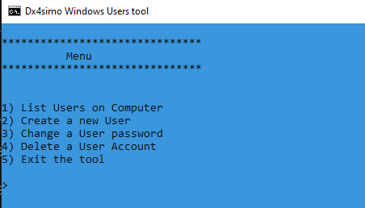

# Windows User Account Management Practice

A small Windows command-line practice project created to learn basic user account management concepts in a local Windows environment.

This project was developed as a learning exercise to understand how Windows user administration works, including working with command-line commands, permissions and local system management.

---

## Note

Some of my older projects were transferred from my previous GitHub account to this new profile because the old account could not be recovered.

---

## Disclaimer

This project is for educational purposes only.

It must only be used on your own computer, in a personal lab environment, or on systems where you have explicit permission and administrator rights.

Do not use this project on devices or accounts that you do not own or manage.

---

## Features

* Practice with Windows user account management
* Basic command-line interaction
* Local user administration in an authorized environment
* Simple script structure
* Practical learning about Windows permissions and system administration

---

## Skills Practiced

Through this project, I practiced:

* Windows command-line basics
* User account management concepts
* Working with administrator permissions
* Basic scripting logic
* Understanding responsible system administration
* Writing small tools for learning purposes

---

## Technologies Used

* Windows Command Line
* Batch scripting / PowerShell
* Basic system administration commands

---

## Usage

This project should only be tested in a local lab environment with administrator permission.

---

## Screenshots

Add your screenshots inside the `screenshots` folder and update the path below:

---

## What I Learned

This project helped me understand how local Windows user account management works and why administrator permissions are important.

It also helped me learn more about responsible use of system administration tools and the importance of working only in authorized environments.

---

## Future Improvements

* Improve documentation
* Add clearer error messages
* Add permission checks
* Add safer user prompts
* Keep the project focused on educational and authorized use only

---

## Author

**Islam Albadawy**
Aspiring Software Developer 
